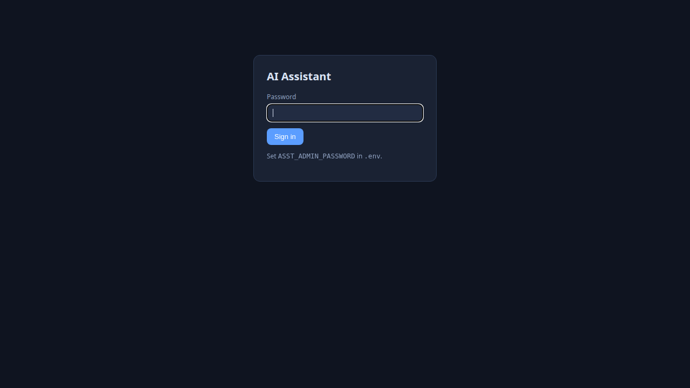
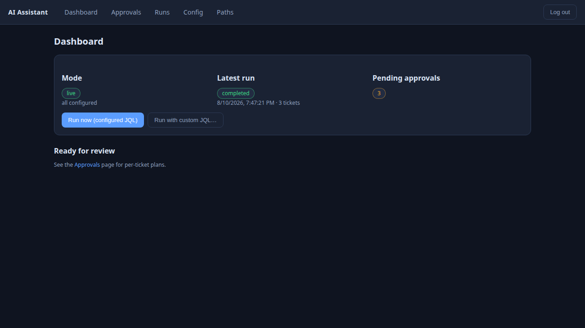

# AI Assistant

Personal, single-user assistant that **nightly scans Jira tickets, AI-triages them
into configurable paths, drafts an Action Plan per ticket, waits for human approval
in a web console, then deterministically executes the approved actions** against
Jira and GitHub.

## How it works

1. **Scan** — runs configured JQL queries on a schedule (or on demand from the UI).
2. **Triage** — each unresolved ticket is fed to an opencode agent (`triage`), which
   reads the ticket and routes it into one of the configurable *paths*
   (`bug-fix`, `new-feature`, `need-more-info`, …), each with its own `instruct.md`
   + `allowed_actions` whitelist.
3. **Plan** — for code paths, an action agent clones the resolved repo into a sandbox,
   makes the fix (`git diff` captured as the plan's patch), and drafts an Action Plan.
4. **Approve** — you review plans in the web console and approve or reject.
5. **Execute** — the executor runs the approved actions deterministically
   (never calls a model): Jira comment/transition, GitHub branch + PR, etc.
   The patch hash is re-verified before it's applied.

## Screenshots

| Login | Console (after a run) |
|---|---|
|  |  |

## Quickstart (mock mode, zero credentials)

```bash
set -a; . ./.env; set +a          # set ASST_MOCK=1 first (edit .env)
python3 -m uvicorn assistant.main:app --port 8010
```

Open http://127.0.0.1:8010 — login with the password in `config/settings.json` / `.env`.
Mock mode ships 5 DEMO tickets plus a real local bare-git remote, so clone → patch →
push → PR workflows run with no network access.

**Live mode:** `ASST_MOCK=0` plus real creds in `.env` (Jira base/email/api-token,
`ASST_GITHUB_REPOS` + `ASST_GITHUB_TOKEN`). The app does **not** auto-load `.env` —
export it first, e.g. `set -a; . ./.env; set +a`.

## Verify / test

```bash
python3 -m compileall -q assistant/                              # syntax gate
set -a; . ./.env; set +a; python3 scripts/smoke_live.py          # read-only health check
```

Full mock E2E lives outside the repo at `/tmp/opencode-asst/e2e.py` and `e2e_v2.py`
(headless via FastAPI `TestClient`).

## Layout

- `assistant/` — FastAPI app, runner pipeline, triage + action agents, deterministic executor,
  integrations (Jira, GitHub, git).
- `paths/<id>/` — per-path `instruct.md` + `schema.json`, `allowed_actions` whitelist.
- `config/` — `settings.json` (JQL, schedule, non-secret settings) + `repo_map.json` (repo overrides).
- `web/static/` — vanilla-JS SPA served at `/`.
- `.opencode/agent/` — opencode agents (`triage`, `action-worker`).

## Conventions

- Deterministic execution — the executor must never call a model; AI is used only for
  triage and fixing, before human approval.
- Secrets live only in `.env` (gitignored); env vars are `ASST_*` and override
  `config/settings.json`.
- See `AGENTS.md` for detailed architecture notes and gotchas.